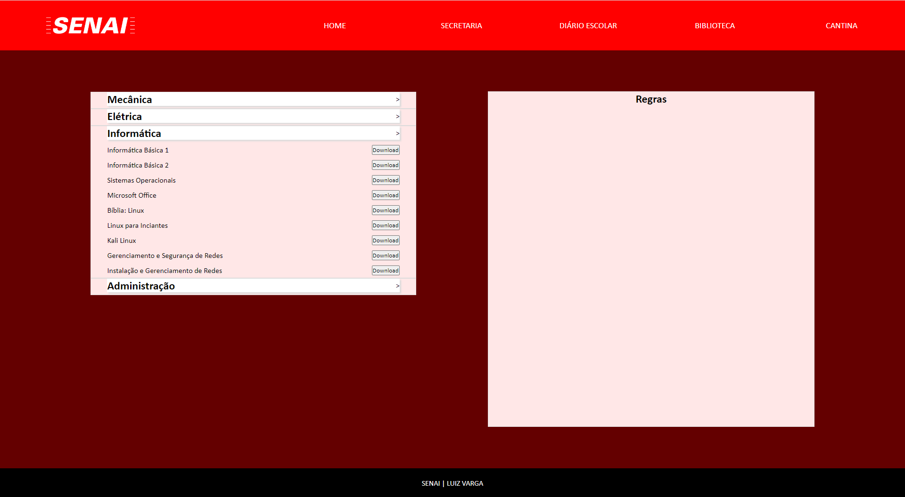

<h1 align="center">
  
</h1>

<h1 align="center"> SIASO </h1>

 Web Aplicação com funcionalidades JavaScript 

<h2 align="center">
  
  
  
  
</h2>

<h2 id="index"> 📌 Índice </h2>

   
  <a href="#index"> Índice </a> &nbsp; &nbsp; &nbsp; | &nbsp; &nbsp; &nbsp;  
  <a href="#nome-do-projeto"> Nome do Projeto </a> &nbsp; &nbsp; &nbsp; | &nbsp; &nbsp; &nbsp;          
  <a href="#descricao"> Descrição e motivação </a> &nbsp; &nbsp; &nbsp; | &nbsp; &nbsp; &nbsp;         
  <a href="#badges"> Badges </a> &nbsp; &nbsp; &nbsp; | &nbsp; &nbsp; &nbsp;        
  <a href="#visuais-e-telas"> Visuais e Telas </a> &nbsp; &nbsp; &nbsp; | &nbsp; &nbsp; &nbsp;        
  <a href="#tecnologias">Tecnologias </a> &nbsp; &nbsp; &nbsp; | &nbsp; &nbsp; &nbsp;       
  <a href="#uso"> Uso </a> &nbsp; &nbsp; &nbsp; | &nbsp; &nbsp; &nbsp;        
  <a href="#status-do-projeto"> Status do projeto </a> &nbsp; &nbsp; &nbsp; | &nbsp; &nbsp; &nbsp; &nbsp;        
  <a href="#issues"> Issues </a>  &nbsp; &nbsp; &nbsp; | &nbsp; &nbsp; &nbsp;  
  <a href="#contribuicoes"> Contribuições </a> &nbsp; &nbsp; &nbsp; | &nbsp; &nbsp; &nbsp;        
  <a href="#autores-e-agradecimentos"> Autores e Agradecimentos </a>  &nbsp; &nbsp; &nbsp; | &nbsp; &nbsp; &nbsp;  
  <a href="#referencias"> Referências </a>  &nbsp; &nbsp; &nbsp; | &nbsp; &nbsp; &nbsp;  
  <a href="#licenca"> Licença </a>    

<h2 id="nome-do-projeto"> Nome do Projeto </h2>
<h3> SIASO - Situação de Aprendizagem Sistemas Operacionais </h3>

<h2 id="descricao"> Descrição </h2>

 Web Aplicação desenvolvida em HTML5, CSS3 e JavaScript, contendo 5 páginas, cada uma com um tipo de funcionalidade que tende a ser única. 

<h3> 🎯 Motivo </h3>

 Na Instituição Senai Luiz Varga, localizada em Limeira, o professor Eduardo Costa solicitou a realização de uma aplicação que atendesse os requisitos passados por ele. Nós, a equipe Ultron, nos responsabilizamos por realizar portanto uma aplicação web sem, a princípio, conexão com banco de dados, utilizando apenas os conhecimentos obtidos pela educação dada a nós pela instituição. 

<h2 id="badges"> Badges </h2>

<h2 id="visuais-e-telas"> Visuais e Telas </h2>

 Tela Biblioteca: 

<h3> GIF's </h3>

<h2 id="tecnologias"> Tecnologias </h2>
<table>
  <thead>
    <tr>
      <th> Dia </th>
      <th> Descrição </th>
      <th> Tecnologias </th>
    </tr>
  </thead>
  <tbody>
    <tr>
      <td> 18/05 </td>
      <td> Estruturação básica </td>
      <td>  </td>
    </tr>
    <tr>
      <td> 19/05 </td>
      <td> Funcionalidades JavaScript </td>
      <td>  </td>
    </tr>
    <tr>
      <td> 25/05 </td>
      <td> Estilização básica </td>
      <td>  </td>
    </tr>
  </tbody>
</table>

<h3> Funcionalidades </h3>
<ul>
  <li> [x] Estrutura HTML </li>
  <li> [x] Estilização básica para funcionamento do Javascript </li>
  <li> [ ] Conexão com banco de dados </li>
  <li> [ ] Responsividade </li>
  <li>
    [ ] Landing Page
    <ul>
      <li> [x] Impedir usuário de acessar links sem estar Logado</li>
      <li> [x] Verificação de e-mail e senha </li>
      <li> [ ] Salvar Login </li>
    </ul>
  </li>
  <li>
    [x] Secretaria
    <ul>
      <li> [x] Efeito hover dos Cards</li>
      <li> [x] Expansão/Encolhimento dos Cards </li>
    </ul>
  </li>
  <li>
    [ ] Diário Escolar
    <ul>
      <li> [x] Troca de Conteúdo </li>
      <li> [x] Valores Randômicos à tabela </li>
      <li> [ ] Matemática correta para Conteúdo das Tabelas/Contato </li>
    </ul>
  </li>
  <li>
    [ ] Biblioteca
    <ul>
      <li> [x] Menu Expansível </li>
      <li> [x] Opção X recolhe quando opção Y é expandida </li>
      <li> [ ] Valores randômicos de aluguel de livros </li>
    </ul>
  </li>
  <li>
    [x] Cantina
    <ul>
      <li> [x] Escolha randômica dos alimentos </li>
      <li> [x] Escolha randômica do alimento barato do dia </li>
    </ul>
  </li>
</ul>

<h2 id="uso"> Uso </h2>

 Acesse a <a href="">documentação</a> para informações mais detalhadas quanto para com a Web Aplicação. 

<h2 id="status-do-projeto"> Status do Projeto </h2>

  

 Projeto em Desenvolvimento 

 O seguimento do projeto se dará pela resposa a ser obtida dia 25/05. 

<h2 id="issues"> 🐛 Issues </h2>

 Formas de Contato 

<ul>
  <li>
    Email:
    <ul>
      <li> [LoriaLawrenceZ] Lorenzo O. Zimbres: lorenzozimbresfilmmaker@gmail.com</li>
      <li> [Paiva8859] Gabriel A. Paiva: gabrielaguilarpaiva@gmail.com </li>
      <li> [TheuZCoder] Matheus R. Silva: matheusrdsilva1@gmail.com </li>
    </ul>
  </li>
  
  <li>
    Discord:
    <ul>
      <li> Server: ____ </li>
    </ul>
  </li>
</ul>

> Sinta-se à vontade para registrar um novo problema com o respectivo título e descrição no repositório.
> Se você já encontrou uma solução para eu problema, vamos adorar revisar o seu Pull Request!

<h2 id="contribuicoes"> 🤝 Contribuições </h2>

 Caso deseje participar do nosso projeto, entre em contato pelo email ___@___ ou por um canal específico em noso Discord. Para mais detalhes, leia a nossa <a href="">documentção</a>. 

<h2 id="autores-e-agradecimentos"> Autores e agradecimentos </h2>
<h3> Desenvolvedores </h3>

  <table style="width: 100%">
    <tbody>
      <tr align=center>
        <th><strong> Lorenzo O. Zimbres   LoriaLawrenceZ </strong></th>
        <th><strong> Gabriel A. Paiva   Paiva8859 </strong></th>
        <th><strong> Matheus R. Silva   TheuZCoder</strong></th>
      </tr>
      <tr align=center>
        <td>
          
        </td>
        <td>
          
        </td>
        <td>
          
        </td>
      </tr>
    </tbody>

  </table>

<h2 id="referencias"> Referências </h2>

* Guias
    - [Shyoutarou README-Model](https://github.com/shyoutarou/README-Model/blob/master/README.md?plain=1)

* Badges
    - [Shields](https://shields.io/)
    - [Template Badges](https://github.com/iuricode/readme-template/blob/main/badges/badges.md)

<h2 id="licenca"> Licença </h2>

