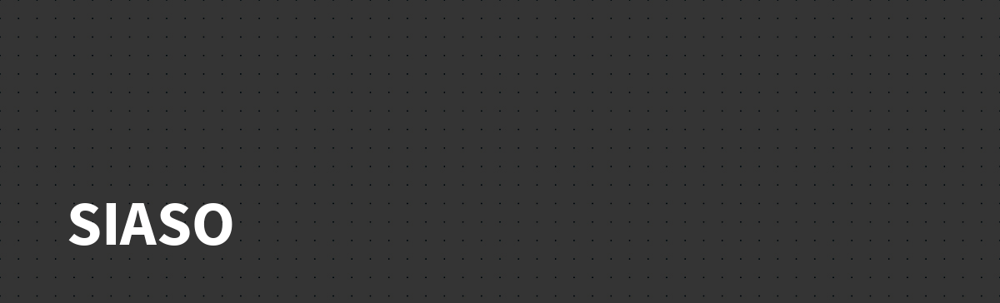

<h1 align="center">
  
</h1>

<h1 align="center"> 🏗️ SIASO 🏗️ </h1>

 Web Aplicação com funcionalidades JavaScript 

<h2 align="center">
  
  
  
  
</h2>

<h2 id="index"> 📌 Índice </h2>

   
  <a href="#index"> Índice </a> &nbsp; &nbsp; &nbsp; | &nbsp; &nbsp; &nbsp;  
  <a href="#nome-do-projeto"> Nome do Projeto </a> &nbsp; &nbsp; &nbsp; | &nbsp; &nbsp; &nbsp;          
  <a href="#descrição"> Descrição e motivação </a> &nbsp; &nbsp; &nbsp; | &nbsp; &nbsp; &nbsp;         
  <a href="#badges"> Badges </a> &nbsp; &nbsp; &nbsp; | &nbsp; &nbsp; &nbsp;        
  <a href="#visuais-e-telas"> Visuais e Telas </a> &nbsp; &nbsp; &nbsp; | &nbsp; &nbsp; &nbsp;        
  <a href="#tecnologias">Tecnologias </a> &nbsp; &nbsp; &nbsp; | &nbsp; &nbsp; &nbsp;       
  <a href="#uso"> Uso </a> &nbsp; &nbsp; &nbsp; | &nbsp; &nbsp; &nbsp;        
  <a href="#status-do-projeto"> Status do projeto </a> &nbsp; &nbsp; &nbsp; | &nbsp; &nbsp; &nbsp; &nbsp;        
  <a href="#issues"> Issues </a>  &nbsp; &nbsp; &nbsp; | &nbsp; &nbsp; &nbsp;  
  <a href="#contribuições"> Contribuições </a> &nbsp; &nbsp; &nbsp; | &nbsp; &nbsp; &nbsp;        
  <a href="#autor-e-agradecimentos"> Autores e Agradecimentos </a>  &nbsp; &nbsp; &nbsp; | &nbsp; &nbsp; &nbsp;  
  <a href="#referências"> Referências </a>  &nbsp; &nbsp; &nbsp; | &nbsp; &nbsp; &nbsp;  
  <a href="#licença"> Licença </a>    

<h2 id="nome-do-projeto"> Nome do Projeto </h2>
<h3> SIASO - Situação de Aprendizagem Sistemas Operacionais </h3>

<h2> Descrição </h2>

 Web Aplicação desenvolvida em HTML5, CSS3 e JavaScript, contendo 5 páginas, cada uma com um tipo de funcionalidade que tende a ser única. 

<h3> 🎯 Motivo </h3>

 Na Instituição Senai Luiz Varga, localizada em Limeira, o professor Eduardo Costa solicitou a realização de uma aplicação que atendesse os requisitos passados por ele. Nós, a equipe Ultron, nos responsabilizamos por realizar portanto uma aplicação web sem, a princípio, conexão com banco de dados, utilizando apenas os conhecimentos obtidos pela educação dada a nós pela instituição. 

